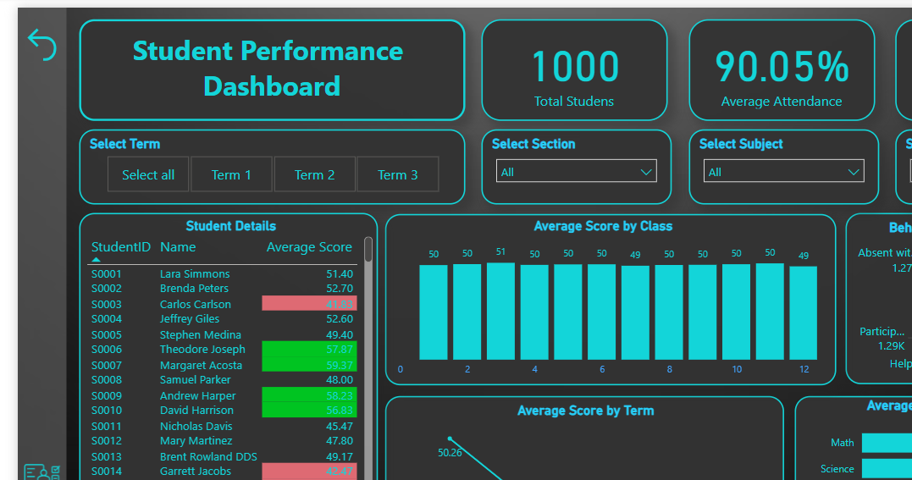

## 🖼️ Dashboard Preview

> 

# 🎓 Students Performance Dashboard 📊

Welcome to the **Students Performance Analysis Dashboard** – a smart, interactive Power BI report designed to help educators, administrators, and analysts gain valuable insights into students' academic performance and trends across various categories. 🧠📘

---

## 📌 Project Overview

This dashboard visually showcases student performance data with the goal of:

- Identifying top-performing students 🥇
- Monitoring subject-wise strengths and weaknesses 📚
- Analyzing performance by gender, parental education, lunch type, and test preparation 📊
- Making data-driven academic interventions 🎯

---

## 🎯 Key Objectives

- ✅ Understand how demographic and social factors impact student scores.
- ✅ Measure overall and subject-wise academic achievement.
- ✅ Provide interactive filtering and comparison features.
- ✅ Create actionable insights for improving student outcomes.

---

## 📈 Insights & Visuals

This dashboard includes:

- **Score Distribution by Gender** 👩‍🎓👨‍🎓  
- **Subject-wise Average Scores** in Math, Reading, and Writing ✏️  
- **Test Preparation Course vs. Performance** 💡  
- **Interactive Filters** to drill down by multiple categories

---

## 🧮 DAX Measures Used

Here are some of the key Power BI calculations & measures:

- `Average Math Score`
- `Overall Average Score`
- `Score Category` (e.g., Low / Medium / High Performers)
- % students above/below benchmark 📐

---

## ⚙️ Technologies Used

- **Power BI Desktop**
- **DAX (Data Analysis Expressions)**
- **Data Modeling**
- **Slicers & Filters**
- **Custom Visuals** (if applicable)

---

## 🏁 How to Use

1. Open `Practical Final Project.pbix` in Power BI Desktop.
2. Use slicers to explore performance by demographic attributes.
3. Hover over visuals for tooltips and deeper insights.
4. Customize visuals or extend the dataset as needed.

---

## 💡 Conclusion

This dashboard helps educators make smarter decisions backed by data! From identifying high achievers to understanding support gaps, it's a one-stop tool for academic excellence. 🌟

---

## 🙌 Let's Connect!

Feel free to share your feedback or suggestions. Collaboration makes dashboards better! 🔄
